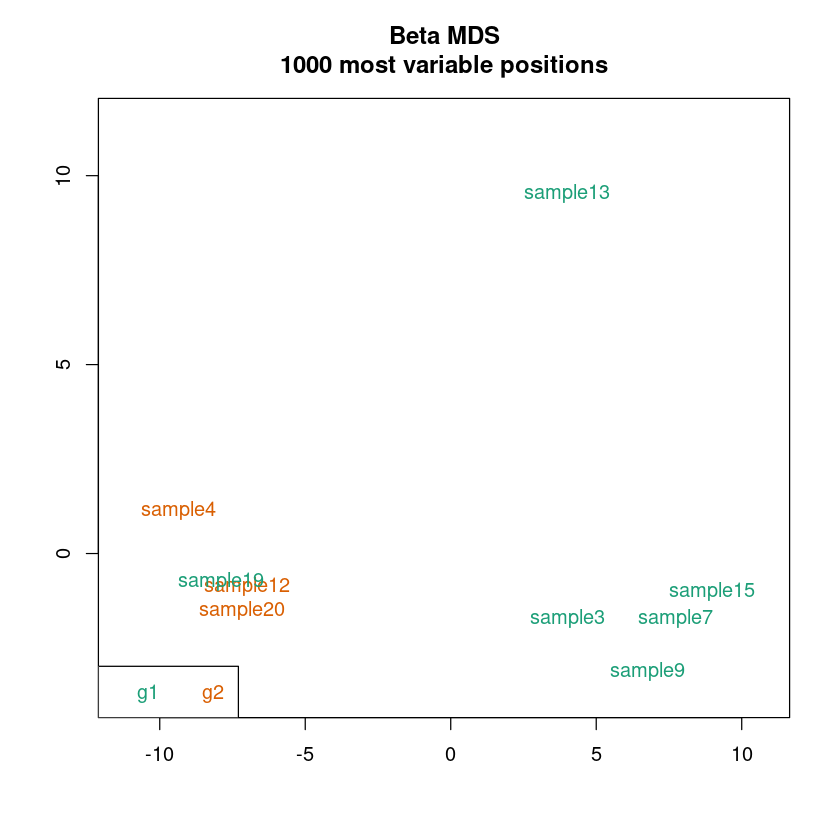
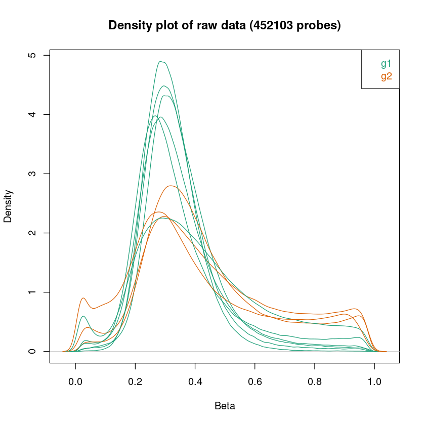
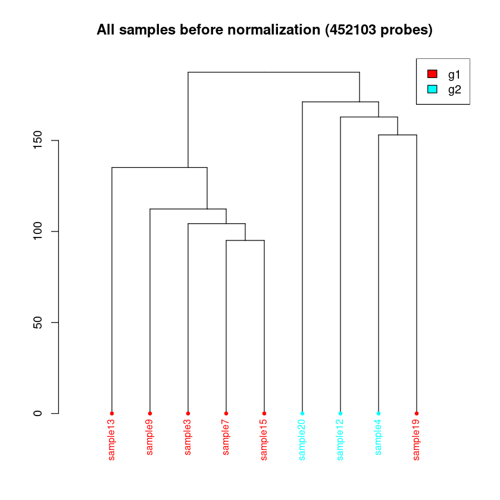
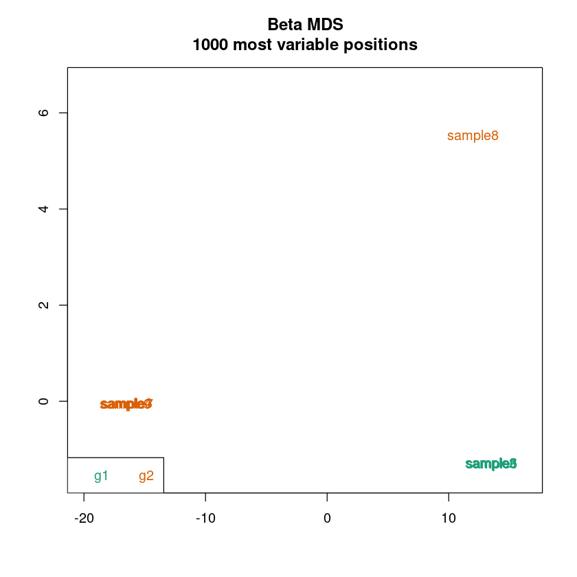
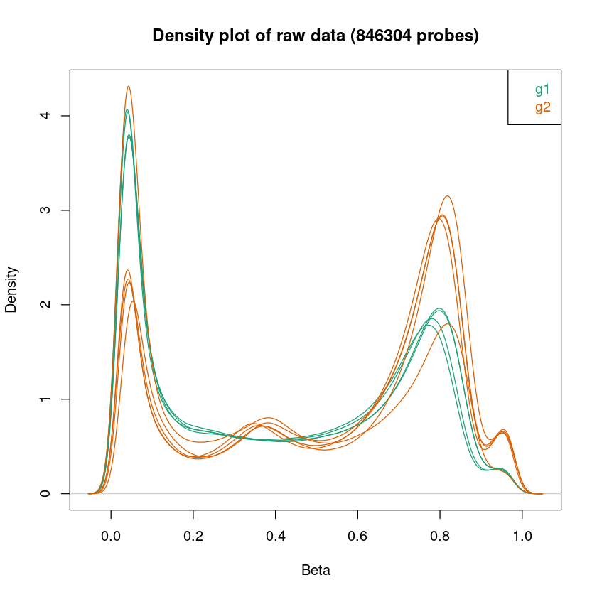
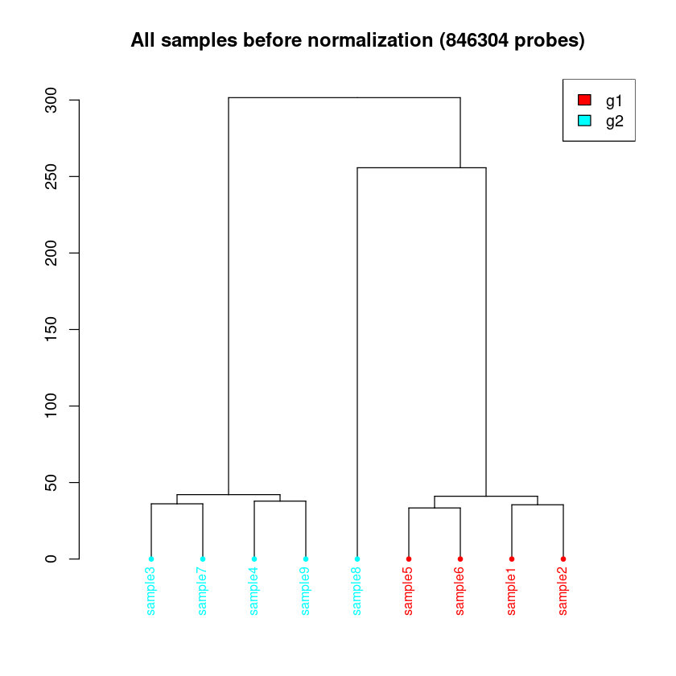

```R
# import all needed R packages
library(ChAMP)
library(ChAMPdata)
library(ggplot2)
library(stringr)
library(ggpubr)
```

    Lade nötiges Paket: minfi
    
    Lade nötiges Paket: BiocGenerics
    
    Lade nötiges Paket: generics
    
    
    Attache Paket: ‘generics’
    
    
    Die folgenden Objekte sind maskiert von ‘package:base’:
    
        as.difftime, as.factor, as.ordered, intersect, is.element, setdiff,
        setequal, union
    
    
    
    Attache Paket: ‘BiocGenerics’
    
    
    Die folgenden Objekte sind maskiert von ‘package:stats’:
    
        IQR, mad, sd, var, xtabs
    
    
    Die folgenden Objekte sind maskiert von ‘package:base’:
    
        anyDuplicated, aperm, append, as.data.frame, basename, cbind,
        colnames, dirname, do.call, duplicated, eval, evalq, Filter, Find,
        get, grep, grepl, is.unsorted, lapply, Map, mapply, match, mget,
        order, paste, pmax, pmax.int, pmin, pmin.int, Position, rank,
        rbind, Reduce, rownames, sapply, saveRDS, table, tapply, unique,
        unsplit, which.max, which.min
    
    
    Lade nötiges Paket: GenomicRanges
    
    Lade nötiges Paket: stats4
    
    Lade nötiges Paket: S4Vectors
    
    
    Attache Paket: ‘S4Vectors’
    
    
    Das folgende Objekt ist maskiert ‘package:utils’:
    
        findMatches
    
    
    Die folgenden Objekte sind maskiert von ‘package:base’:
    
        expand.grid, I, unname
    
    
    Lade nötiges Paket: IRanges
    
    Lade nötiges Paket: GenomeInfoDb
    
    Lade nötiges Paket: SummarizedExperiment
    
    Lade nötiges Paket: MatrixGenerics
    
    Lade nötiges Paket: matrixStats
    
    
    Attache Paket: ‘MatrixGenerics’
    
    
    Die folgenden Objekte sind maskiert von ‘package:matrixStats’:
    
        colAlls, colAnyNAs, colAnys, colAvgsPerRowSet, colCollapse,
        colCounts, colCummaxs, colCummins, colCumprods, colCumsums,
        colDiffs, colIQRDiffs, colIQRs, colLogSumExps, colMadDiffs,
        colMads, colMaxs, colMeans2, colMedians, colMins, colOrderStats,
        colProds, colQuantiles, colRanges, colRanks, colSdDiffs, colSds,
        colSums2, colTabulates, colVarDiffs, colVars, colWeightedMads,
        colWeightedMeans, colWeightedMedians, colWeightedSds,
        colWeightedVars, rowAlls, rowAnyNAs, rowAnys, rowAvgsPerColSet,
        rowCollapse, rowCounts, rowCummaxs, rowCummins, rowCumprods,
        rowCumsums, rowDiffs, rowIQRDiffs, rowIQRs, rowLogSumExps,
        rowMadDiffs, rowMads, rowMaxs, rowMeans2, rowMedians, rowMins,
        rowOrderStats, rowProds, rowQuantiles, rowRanges, rowRanks,
        rowSdDiffs, rowSds, rowSums2, rowTabulates, rowVarDiffs, rowVars,
        rowWeightedMads, rowWeightedMeans, rowWeightedMedians,
        rowWeightedSds, rowWeightedVars
    
    
    Lade nötiges Paket: Biobase
    
    Welcome to Bioconductor
    
        Vignettes contain introductory material; view with
        'browseVignettes()'. To cite Bioconductor, see
        'citation("Biobase")', and for packages 'citation("pkgname")'.
    
    
    
    Attache Paket: ‘Biobase’
    
    
    Das folgende Objekt ist maskiert ‘package:MatrixGenerics’:
    
        rowMedians
    
    
    Die folgenden Objekte sind maskiert von ‘package:matrixStats’:
    
        anyMissing, rowMedians
    
    
    Lade nötiges Paket: Biostrings
    
    Lade nötiges Paket: XVector
    
    
    Attache Paket: ‘Biostrings’
    
    
    Das folgende Objekt ist maskiert ‘package:base’:
    
        strsplit
    
    
    Lade nötiges Paket: bumphunter
    
    Lade nötiges Paket: foreach
    
    Lade nötiges Paket: iterators
    
    Lade nötiges Paket: parallel
    
    Lade nötiges Paket: locfit
    
    locfit 1.5-9.12 	 2025-03-05
    
    Setting options('download.file.method.GEOquery'='auto')
    
    Setting options('GEOquery.inmemory.gpl'=FALSE)
    
    Lade nötiges Paket: ChAMPdata
    
    Lade nötiges Paket: DMRcate
    
    
    
    Lade nötiges Paket: Illumina450ProbeVariants.db
    
    Lade nötiges Paket: IlluminaHumanMethylationEPICmanifest
    
    Lade nötiges Paket: DT
    
    Lade nötiges Paket: RPMM
    
    Lade nötiges Paket: cluster
    
    Keine Methoden in Paket 'RSQLite' gefunden für Anforderung: 'dbListFields' beim Laden von 'lumi'
    
    Warning message:
    "vorhergehender Import 'plyr::mutate' durch 'plotly::mutate' während des Ladens von 'ChAMP' ersetzt"
    Warning message:
    "vorhergehender Import 'plyr::rename' durch 'plotly::rename' während des Ladens von 'ChAMP' ersetzt"
    Warning message:
    "vorhergehender Import 'plyr::arrange' durch 'plotly::arrange' während des Ladens von 'ChAMP' ersetzt"
    Warning message:
    "vorhergehender Import 'plyr::summarise' durch 'plotly::summarise' während des Ladens von 'ChAMP' ersetzt"
    
    
    Warning message:
    "vorhergehender Import 'plotly::subplot' durch 'Hmisc::subplot' während des Ladens von 'ChAMP' ersetzt"
    Warning message:
    "vorhergehender Import 'plyr::summarize' durch 'Hmisc::summarize' während des Ladens von 'ChAMP' ersetzt"
    Warning message:
    "vorhergehender Import 'plyr::is.discrete' durch 'Hmisc::is.discrete' während des Ladens von 'ChAMP' ersetzt"
    Warning message:
    "vorhergehender Import 'plotly::last_plot' durch 'ggplot2::last_plot' während des Ladens von 'ChAMP' ersetzt"
    Warning message:
    "vorhergehender Import 'globaltest::model.matrix' durch 'stats::model.matrix' während des Ladens von 'ChAMP' ersetzt"
    Warning message:
    "vorhergehender Import 'globaltest::p.adjust' durch 'stats::p.adjust' während des Ladens von 'ChAMP' ersetzt"
    >> Package version 2.29.1 loaded <<
           ___ _      _   __  __ ___ 
          / __| |_   /_\ |  \/  | _ \
         | (__| ' \ / _ \| |\/| |  _/
          \___|_||_/_/ \_\_|  |_|_|  
          ------------------------------
        If you have any question or suggestion about ChAMP, please email to champ450k@gmail.com.
        Thank you for citating ChAMP:
    
        Yuan Tian, Tiffany J Morris, Amy P Webster, Zhen Yang, Stephan Beck, Andrew Feber, Andrew E Teschendorff; ChAMP: updated methylation analysis pipeline for Illumina BeadChips, Bioinformatics, btx513, https://doi.org/10.1093/bioinformatics/btx513    REQUIRE ChAMPdata >= 2.23.1
    


```R
mystery_1 <- "../../example_datasets/epicv2/mystery_data_1"
mystery_2 <- "../../example_datasets/epicv2/mystery_data_2"
```

### Analyse mystery_data_1
Laden Sie den Datensatz im Verzeichnis mystery_data_1 und schauen Sie sich den **Output von champ.laod** die **QC Plots** an:
- Was fällt Ihnen am Output von champ.load auf?
- Wozu führt die Änderung des *detPcut* Parameters in *champ.load*?
- Warum wurde der Parameter verändert?
- Was fällt Ihnen an den Plots auf?
- Worauf könnte das zu sehende hindeuten?
- Wie könnten Sie damit umgehen?


```R
# all parameters except one are default
myData_1 <- champ.load(directory = fragmented,
                     method="ChAMP",
                     methValue="B",
                     autoimpute=TRUE,
                     filterDetP=TRUE,
                     ProbeCutoff=0,
                     SampleCutoff=0.1,
                     detPcut=0.9, # This is the only parameter which was changed compared to the default settings of champ.load
                     filterBeads=TRUE,
                     beadCutoff=0.05,
                     filterNoCG=TRUE,
                     filterSNPs=TRUE,
                     population=NULL,
                     filterMultiHit=TRUE,
                     filterXY=TRUE,
                     force=FALSE,
                     arraytype="EPICv2")

```

    [===========================]
    
    [<<<< ChAMP.LOAD START >>>>>]
    
    -----------------------------
    
    
    [ Loading Data with ChAMP Method ]
    
    ----------------------------------
    
    Note that ChAMP method will NOT return rgSet or mset, they object defined by minfi. Which means, if you use ChAMP method to load data, you can not use SWAN or FunctionNormliazation method in champ.norm() (you can use BMIQ or PBC still). But All other function should not be influenced.
    
    
    [===========================]
    
    [<<<< ChAMP.IMPORT START >>>>>]
    
    -----------------------------
    
    
    [ Section 1: Read PD Files Start ]
    
      CSV Directory: ../../example_datasets/epicv2/mystery_data_1/samplesheet.csv
    
      Find CSV Success
    
      Reading CSV File
    
      Replace Sentrix_Position into Array
    
      Replace Sentrix_ID into Slide
    
    [ Section 1: Read PD file Done ]
    
    
    
    [ Section 2: Read IDAT files Start ]
    
      Loading:../../example_datasets/epicv2/mystery_data_1/data_directory/111111111111/111111111111_R05C01_Grn.idat ---- (1/20)
    
      Loading:../../example_datasets/epicv2/mystery_data_1/data_directory/111111111111/111111111111_R06C01_Grn.idat ---- (2/20)
    
      Loading:../../example_datasets/epicv2/mystery_data_1/data_directory/111111111111/111111111111_R07C01_Grn.idat ---- (3/20)
    
      Loading:../../example_datasets/epicv2/mystery_data_1/data_directory/111111111111/111111111111_R08C01_Grn.idat ---- (4/20)
    
      Loading:../../example_datasets/epicv2/mystery_data_1/data_directory/222222222222/222222222222_R01C01_Grn.idat ---- (5/20)
    
      Loading:../../example_datasets/epicv2/mystery_data_1/data_directory/222222222222/222222222222_R02C01_Grn.idat ---- (6/20)
    
      Loading:../../example_datasets/epicv2/mystery_data_1/data_directory/222222222222/222222222222_R03C01_Grn.idat ---- (7/20)
    
      Loading:../../example_datasets/epicv2/mystery_data_1/data_directory/222222222222/222222222222_R04C01_Grn.idat ---- (8/20)
    
      Loading:../../example_datasets/epicv2/mystery_data_1/data_directory/222222222222/222222222222_R05C01_Grn.idat ---- (9/20)
    
      Loading:../../example_datasets/epicv2/mystery_data_1/data_directory/222222222222/222222222222_R06C01_Grn.idat ---- (10/20)
    
      Loading:../../example_datasets/epicv2/mystery_data_1/data_directory/222222222222/222222222222_R07C01_Grn.idat ---- (11/20)
    
      Loading:../../example_datasets/epicv2/mystery_data_1/data_directory/222222222222/222222222222_R08C01_Grn.idat ---- (12/20)
    
      Loading:../../example_datasets/epicv2/mystery_data_1/data_directory/333333333333/333333333333_R01C01_Grn.idat ---- (13/20)
    
      Loading:../../example_datasets/epicv2/mystery_data_1/data_directory/333333333333/333333333333_R02C01_Grn.idat ---- (14/20)
    
      Loading:../../example_datasets/epicv2/mystery_data_1/data_directory/333333333333/333333333333_R03C01_Grn.idat ---- (15/20)
    
      Loading:../../example_datasets/epicv2/mystery_data_1/data_directory/333333333333/333333333333_R04C01_Grn.idat ---- (16/20)
    
      Loading:../../example_datasets/epicv2/mystery_data_1/data_directory/333333333333/333333333333_R05C01_Grn.idat ---- (17/20)
    
      Loading:../../example_datasets/epicv2/mystery_data_1/data_directory/333333333333/333333333333_R06C01_Grn.idat ---- (18/20)
    
      Loading:../../example_datasets/epicv2/mystery_data_1/data_directory/333333333333/333333333333_R07C01_Grn.idat ---- (19/20)
    
      Loading:../../example_datasets/epicv2/mystery_data_1/data_directory/333333333333/333333333333_R08C01_Grn.idat ---- (20/20)
    
      Loading:../../example_datasets/epicv2/mystery_data_1/data_directory/111111111111/111111111111_R05C01_Red.idat ---- (1/20)
    
      Loading:../../example_datasets/epicv2/mystery_data_1/data_directory/111111111111/111111111111_R06C01_Red.idat ---- (2/20)
    
      Loading:../../example_datasets/epicv2/mystery_data_1/data_directory/111111111111/111111111111_R07C01_Red.idat ---- (3/20)
    
      Loading:../../example_datasets/epicv2/mystery_data_1/data_directory/111111111111/111111111111_R08C01_Red.idat ---- (4/20)
    
      Loading:../../example_datasets/epicv2/mystery_data_1/data_directory/222222222222/222222222222_R01C01_Red.idat ---- (5/20)
    
      Loading:../../example_datasets/epicv2/mystery_data_1/data_directory/222222222222/222222222222_R02C01_Red.idat ---- (6/20)
    
      Loading:../../example_datasets/epicv2/mystery_data_1/data_directory/222222222222/222222222222_R03C01_Red.idat ---- (7/20)
    
      Loading:../../example_datasets/epicv2/mystery_data_1/data_directory/222222222222/222222222222_R04C01_Red.idat ---- (8/20)
    
      Loading:../../example_datasets/epicv2/mystery_data_1/data_directory/222222222222/222222222222_R05C01_Red.idat ---- (9/20)
    
      Loading:../../example_datasets/epicv2/mystery_data_1/data_directory/222222222222/222222222222_R06C01_Red.idat ---- (10/20)
    
      Loading:../../example_datasets/epicv2/mystery_data_1/data_directory/222222222222/222222222222_R07C01_Red.idat ---- (11/20)
    
      Loading:../../example_datasets/epicv2/mystery_data_1/data_directory/222222222222/222222222222_R08C01_Red.idat ---- (12/20)
    
      Loading:../../example_datasets/epicv2/mystery_data_1/data_directory/333333333333/333333333333_R01C01_Red.idat ---- (13/20)
    
      Loading:../../example_datasets/epicv2/mystery_data_1/data_directory/333333333333/333333333333_R02C01_Red.idat ---- (14/20)
    
      Loading:../../example_datasets/epicv2/mystery_data_1/data_directory/333333333333/333333333333_R03C01_Red.idat ---- (15/20)
    
      Loading:../../example_datasets/epicv2/mystery_data_1/data_directory/333333333333/333333333333_R04C01_Red.idat ---- (16/20)
    
      Loading:../../example_datasets/epicv2/mystery_data_1/data_directory/333333333333/333333333333_R05C01_Red.idat ---- (17/20)
    
      Loading:../../example_datasets/epicv2/mystery_data_1/data_directory/333333333333/333333333333_R06C01_Red.idat ---- (18/20)
    
      Loading:../../example_datasets/epicv2/mystery_data_1/data_directory/333333333333/333333333333_R07C01_Red.idat ---- (19/20)
    
      Loading:../../example_datasets/epicv2/mystery_data_1/data_directory/333333333333/333333333333_R08C01_Red.idat ---- (20/20)
    
    
      Extract Mean value for Green and Red Channel Success
    
        Your Red Green Channel contains 1105209 probes.
    
    [ Section 2: Read IDAT Files Done ]
    
    
    
    [ Section 3: Use Annotation Start ]
    
    
      Reading EPICv2 Annotation >>
    
        !!! Important, since version 2.29.1, ChAMP set default `EPIC` arraytype as EPIC version 2. 
            You can set 'EPIC' or 'EPICv2' to use version 2 EPIC annotation
            If you want to use the old version (v1), please specify arraytype parameter as `EPICv1`. 
            For 450K array, still use `450K`
    
    
      Fetching NEGATIVE ControlProbe.
    
        Totally, there are 411 control probes in Annotation.
    
        Your data set contains 411 control probes.
    
    
      Generating Meth and UnMeth Matrix
    
        Extracting Meth Matrix...
    
          Totally there are 937055 Meth probes in EPICv2 Annotation.
    
          Your data set contains 937055 Meth probes.
    
        Extracting UnMeth Matrix...
    
          Totally there are 937055 UnMeth probes in EPICv2 Annotation.
    
          Your data set contains 937055 UnMeth probes.
    
    
      Generating beta Matrix
    
      Generating M Matrix
    
      Generating intensity Matrix
    
      Calculating Detect P value
    
      Counting Beads
    
    [ Section 3: Use Annotation Done ]
    
    
    [<<<<< ChAMP.IMPORT END >>>>>>]
    
    [===========================]
    
    [You may want to process champ.filter() next.]
    
    
    [===========================]
    
    [<<<< ChAMP.FILTER START >>>>>]
    
    -----------------------------
    
    
    In New version ChAMP, champ.filter() function has been set to do filtering on the result of champ.import(). You can use champ.import() + champ.filter() to do Data Loading, or set "method" parameter in champ.load() as "ChAMP" to get the same effect.
    
    
    This function is provided for user need to do filtering on some beta (or M) matrix, which contained most filtering system in champ.load except beadcount. User need to input beta matrix, pd file themselves. If you want to do filterintg on detP matrix and Bead Count, you also need to input a detected P matrix and Bead Count information.
    
    
    Note that if you want to filter more data matrix, say beta, M, intensity... please make sure they have exactly the same rownames and colnames.
    
    
    
    [ Section 1:  Check Input Start ]
    
      You have inputed beta,intensity for Analysis.
    
    
      pd file provided, checking if it's in accord with Data Matrix...
    
        pd file check success.
    
    
      Parameter filterDetP is TRUE, checking if detP in accord with Data Matrix...
    
        detP check success.
    
    
      Parameter filterBeads is TRUE, checking if beadcount in accord with Data Matrix...
    
        beadcount check success.
    
    
      parameter autoimpute is TRUE. Checking if the conditions are fulfilled...
    
        !!! ProbeCutoff is 0, which means you have no needs to do imputation. autoimpute has been reset FALSE.
    
    
      Checking Finished :filterDetP,filterBeads,filterMultiHit,filterSNPs,filterNoCG,filterXY would be done on beta,intensity.
    
      You also provided :detP,beadcount .
    
    [ Section 1: Check Input Done ]
    
    
    
    [ Section 2: Filtering Start >>
    
    
      Filtering Detect P value Start
    
        The fraction of failed positions per sample
    
        You may need to delete samples with high proportion of failed probes:
    
    


             Failed CpG Fraction.
    sample1            0.10990604
    sample2            0.12215718
    sample3            0.08568867
    sample4            0.05344083
    sample5            0.10018195
    sample6            0.13114598
    sample7            0.09822582
    sample8            0.14327761
    sample9            0.08778353
    sample10           0.12545261
    sample11           0.10311028
    sample12           0.05736163
    sample13           0.09452807
    sample14           0.12113803
    sample15           0.09212480
    sample16           0.11706463
    sample17           0.11174371
    sample18           0.10414223
    sample19           0.05110693
    sample20           0.04452780


    
        The detSamplecut parameter is : 0.1
    
        Samples : sample1,sample2,sample5,sample6,sample8,sample10,sample11,sample14,sample16,sample17,sample18 will be deleted.
    
        There are 9 samples remained for analysis.
    
    
        Filtering probes with a detection p-value above 0.9.
    
        Removing 440434 probes.
    
        If a large number of probes have been removed, ChAMP suggests you to identify potentially bad samples
    
    
      Filtering BeadCount Start
    
        Filtering probes with a beadcount <3 in at least 5% of samples.
    
        Removing 12688 probes
    
    
      Filtering NoCG Start
    
        Only Keep CpGs, removing 1292 probes from the analysis.
    
    
      Filtering SNPs Start
    
    
        !!! Important, since version 2.29.1, ChAMP set default `EPIC` arraytype as EPIC version 2. 
            You can set 'EPIC' or 'EPICv2' to use version 2 EPIC annotation
            If you want to use the old version (v1), please specify arraytype parameter as `EPICv1`. 
            For 450K array, still use `450K`
    
    
        Using general mask options
    
        Removing 20000 probes from the analysis.
    
    
      Filtering MultiHit Start
    
        Filtering probes that align to multiple locations as identified in Nordlund et al
    
        Removing 0 probes from the analysis.
    
    
      Filtering XY Start
    
        Filtering probes located on X,Y chromosome, removing 10538 probes from the analysis.
    
    
      Updating PD file
    
    
      Fixing Outliers Start
    
        Replacing all value smaller/equal to 0 with smallest positive value.
    
        Replacing all value greater/equal to 1 with largest value below 1..
    
    [ Section 2: Filtering Done ]
    
    
     All filterings are Done, now you have 452103 probes and 9 samples.
    
    
    [<<<<< ChAMP.FILTER END >>>>>>]
    
    [===========================]
    
    [You may want to process champ.QC() next.]
    
    
    [<<<<< ChAMP.LOAD END >>>>>>]
    
    [===========================]
    
    [You may want to process champ.QC() next.]
    
    


```R
champ.QC(beta = myData_1$beta,
         pheno=myData_1$pd$Sample_Group,
         resultsDir="./CHAMP_QCimages/")
```

    [===========================]
    
    [<<<<< ChAMP.QC START >>>>>>]
    
    -----------------------------
    
    champ.QC Results will be saved in ./CHAMP_QCimages/
    
    [QC plots will be proceed with 452103 probes and 9 samples.]
    
    
    << Prepare Data Over. >>
    
    << plot mdsPlot Done. >>
    
    


    

    


    << Plot densityPlot Done. >>
    
    
    < Dendrogram Plot Feature Selection Method >: No Selection, directly use all CpGs to calculate distance matrix.
    


    

    


    << Plot dendrogram Done. >>
    
    
    [<<<<<< ChAMP.QC END >>>>>>>]
    
    [===========================]
    
    [You may want to process champ.norm() next.]
    
    


    

    


### Analyse mystery_data_2
Laden Sie den Datensatz im Verzeichnis mystery_data_2 und schauen Sie sich die QC Plots an:
- Was fällt Ihnen an den Plots auf?
- Worauf könnte das zu sehende hindeuten?
- Wie könnten Sie damit umgehen?


```R
# parameters are all default
myData_2 <- champ.load(directory = intra_group_outlier,
                     method="ChAMP",
                     methValue="B",
                     autoimpute=TRUE,
                     filterDetP=TRUE,
                     ProbeCutoff=0,
                     SampleCutoff=0.1,
                     detPcut=0.01,
                     filterBeads=TRUE,
                     beadCutoff=0.05,
                     filterNoCG=TRUE,
                     filterSNPs=TRUE,
                     population=NULL,
                     filterMultiHit=TRUE,
                     filterXY=TRUE,
                     force=FALSE,
                     arraytype="EPICv2")
```

    [===========================]
    
    [<<<< ChAMP.LOAD START >>>>>]
    
    -----------------------------
    
    
    [ Loading Data with ChAMP Method ]
    
    ----------------------------------
    
    Note that ChAMP method will NOT return rgSet or mset, they object defined by minfi. Which means, if you use ChAMP method to load data, you can not use SWAN or FunctionNormliazation method in champ.norm() (you can use BMIQ or PBC still). But All other function should not be influenced.
    
    
    [===========================]
    
    [<<<< ChAMP.IMPORT START >>>>>]
    
    -----------------------------
    
    
    [ Section 1: Read PD Files Start ]
    
      CSV Directory: ../../example_datasets/epicv2/mystery_data_2/samplesheet.csv
    
      Find CSV Success
    
      Reading CSV File
    
      Replace Sentrix_Position into Array
    
      Replace Sentrix_ID into Slide
    
    [ Section 1: Read PD file Done ]
    
    
    
    [ Section 2: Read IDAT files Start ]
    
      Loading:../../example_datasets/epicv2/mystery_data_2/111111111111/111111111111_R01C01_Grn.idat ---- (1/9)
    
      Loading:../../example_datasets/epicv2/mystery_data_2/111111111111/111111111111_R05C01_Grn.idat ---- (2/9)
    
      Loading:../../example_datasets/epicv2/mystery_data_2/111111111111/111111111111_R07C01_Grn.idat ---- (3/9)
    
      Loading:../../example_datasets/epicv2/mystery_data_2/333333333333/333333333333_R04C01_Grn.idat ---- (4/9)
    
      Loading:../../example_datasets/epicv2/mystery_data_2/333333333333/333333333333_R08C01_Grn.idat ---- (5/9)
    
      Loading:../../example_datasets/epicv2/mystery_data_2/111111111111/111111111111_R03C01_Grn.idat ---- (6/9)
    
      Loading:../../example_datasets/epicv2/mystery_data_2/222222222222/222222222222_R07C01_Grn.idat ---- (7/9)
    
      Loading:../../example_datasets/epicv2/mystery_data_2/222222222222/222222222222_R02C01_Grn.idat ---- (8/9)
    
      Loading:../../example_datasets/epicv2/mystery_data_2/111111111111/111111111111_R04C01_Grn.idat ---- (9/9)
    
      Loading:../../example_datasets/epicv2/mystery_data_2/111111111111/111111111111_R01C01_Red.idat ---- (1/9)
    
      Loading:../../example_datasets/epicv2/mystery_data_2/111111111111/111111111111_R05C01_Red.idat ---- (2/9)
    
      Loading:../../example_datasets/epicv2/mystery_data_2/111111111111/111111111111_R07C01_Red.idat ---- (3/9)
    
      Loading:../../example_datasets/epicv2/mystery_data_2/333333333333/333333333333_R04C01_Red.idat ---- (4/9)
    
      Loading:../../example_datasets/epicv2/mystery_data_2/333333333333/333333333333_R08C01_Red.idat ---- (5/9)
    
      Loading:../../example_datasets/epicv2/mystery_data_2/111111111111/111111111111_R03C01_Red.idat ---- (6/9)
    
      Loading:../../example_datasets/epicv2/mystery_data_2/222222222222/222222222222_R07C01_Red.idat ---- (7/9)
    
      Loading:../../example_datasets/epicv2/mystery_data_2/222222222222/222222222222_R02C01_Red.idat ---- (8/9)
    
      Loading:../../example_datasets/epicv2/mystery_data_2/111111111111/111111111111_R04C01_Red.idat ---- (9/9)
    
    
      Extract Mean value for Green and Red Channel Success
    
        Your Red Green Channel contains 1105209 probes.
    
    [ Section 2: Read IDAT Files Done ]
    
    
    
    [ Section 3: Use Annotation Start ]
    
    
      Reading EPICv2 Annotation >>
    
        !!! Important, since version 2.29.1, ChAMP set default `EPIC` arraytype as EPIC version 2. 
            You can set 'EPIC' or 'EPICv2' to use version 2 EPIC annotation
            If you want to use the old version (v1), please specify arraytype parameter as `EPICv1`. 
            For 450K array, still use `450K`
    
    
      Fetching NEGATIVE ControlProbe.
    
        Totally, there are 411 control probes in Annotation.
    
        Your data set contains 411 control probes.
    
    
      Generating Meth and UnMeth Matrix
    
        Extracting Meth Matrix...
    
          Totally there are 937055 Meth probes in EPICv2 Annotation.
    
          Your data set contains 937055 Meth probes.
    
        Extracting UnMeth Matrix...
    
          Totally there are 937055 UnMeth probes in EPICv2 Annotation.
    
          Your data set contains 937055 UnMeth probes.
    
    
      Generating beta Matrix
    
      Generating M Matrix
    
      Generating intensity Matrix
    
      Calculating Detect P value
    
      Counting Beads
    
    [ Section 3: Use Annotation Done ]
    
    
    [<<<<< ChAMP.IMPORT END >>>>>>]
    
    [===========================]
    
    [You may want to process champ.filter() next.]
    
    
    [===========================]
    
    [<<<< ChAMP.FILTER START >>>>>]
    
    -----------------------------
    
    
    In New version ChAMP, champ.filter() function has been set to do filtering on the result of champ.import(). You can use champ.import() + champ.filter() to do Data Loading, or set "method" parameter in champ.load() as "ChAMP" to get the same effect.
    
    
    This function is provided for user need to do filtering on some beta (or M) matrix, which contained most filtering system in champ.load except beadcount. User need to input beta matrix, pd file themselves. If you want to do filterintg on detP matrix and Bead Count, you also need to input a detected P matrix and Bead Count information.
    
    
    Note that if you want to filter more data matrix, say beta, M, intensity... please make sure they have exactly the same rownames and colnames.
    
    
    
    [ Section 1:  Check Input Start ]
    
      You have inputed beta,intensity for Analysis.
    
    
      pd file provided, checking if it's in accord with Data Matrix...
    
        pd file check success.
    
    
      Parameter filterDetP is TRUE, checking if detP in accord with Data Matrix...
    
        detP check success.
    
    
      Parameter filterBeads is TRUE, checking if beadcount in accord with Data Matrix...
    
        beadcount check success.
    
    
      parameter autoimpute is TRUE. Checking if the conditions are fulfilled...
    
        !!! ProbeCutoff is 0, which means you have no needs to do imputation. autoimpute has been reset FALSE.
    
    
      Checking Finished :filterDetP,filterBeads,filterMultiHit,filterSNPs,filterNoCG,filterXY would be done on beta,intensity.
    
      You also provided :detP,beadcount .
    
    [ Section 1: Check Input Done ]
    
    
    
    [ Section 2: Filtering Start >>
    
    
      Filtering Detect P value Start
    
        The fraction of failed positions per sample
    
        You may need to delete samples with high proportion of failed probes:
    
    


            Failed CpG Fraction.
    sample1          0.008623827
    sample2          0.009623768
    sample3          0.010284348
    sample4          0.008498968
    sample5          0.008403989
    sample6          0.010018622
    sample7          0.012234074
    sample8          0.006075417
    sample9          0.008782836


    
        Filtering probes with a detection p-value above 0.01.
    
        Removing 23273 probes.
    
        If a large number of probes have been removed, ChAMP suggests you to identify potentially bad samples
    
    
      Filtering BeadCount Start
    
        Filtering probes with a beadcount <3 in at least 5% of samples.
    
        Removing 12573 probes
    
    
      Filtering NoCG Start
    
        Only Keep CpGs, removing 3508 probes from the analysis.
    
    
      Filtering SNPs Start
    
    
        !!! Important, since version 2.29.1, ChAMP set default `EPIC` arraytype as EPIC version 2. 
            You can set 'EPIC' or 'EPICv2' to use version 2 EPIC annotation
            If you want to use the old version (v1), please specify arraytype parameter as `EPICv1`. 
            For 450K array, still use `450K`
    
    
        Using general mask options
    
        Removing 30917 probes from the analysis.
    
    
      Filtering MultiHit Start
    
        Filtering probes that align to multiple locations as identified in Nordlund et al
    
        Removing 0 probes from the analysis.
    
    
      Filtering XY Start
    
        Filtering probes located on X,Y chromosome, removing 20480 probes from the analysis.
    
    
      Updating PD file
    
    
      Fixing Outliers Start
    
        Replacing all value smaller/equal to 0 with smallest positive value.
    
        Replacing all value greater/equal to 1 with largest value below 1..
    
    [ Section 2: Filtering Done ]
    
    
     All filterings are Done, now you have 846304 probes and 9 samples.
    
    
    [<<<<< ChAMP.FILTER END >>>>>>]
    
    [===========================]
    
    [You may want to process champ.QC() next.]
    
    
    [<<<<< ChAMP.LOAD END >>>>>>]
    
    [===========================]
    
    [You may want to process champ.QC() next.]
    
    


```R
champ.QC(beta = myData_2$beta,
         pheno=myData_2$pd$Sample_Group,
         resultsDir="./CHAMP_QCimages/")
```

    [===========================]
    
    [<<<<< ChAMP.QC START >>>>>>]
    
    -----------------------------
    
    champ.QC Results will be saved in ./CHAMP_QCimages/
    
    [QC plots will be proceed with 846304 probes and 9 samples.]
    
    
    << Prepare Data Over. >>
    
    << plot mdsPlot Done. >>
    
    


    

    


    << Plot densityPlot Done. >>
    
    
    < Dendrogram Plot Feature Selection Method >: No Selection, directly use all CpGs to calculate distance matrix.
    


    

    


    << Plot dendrogram Done. >>
    
    
    [<<<<<< ChAMP.QC END >>>>>>>]
    
    [===========================]
    
    [You may want to process champ.norm() next.]
    
    


    

    

